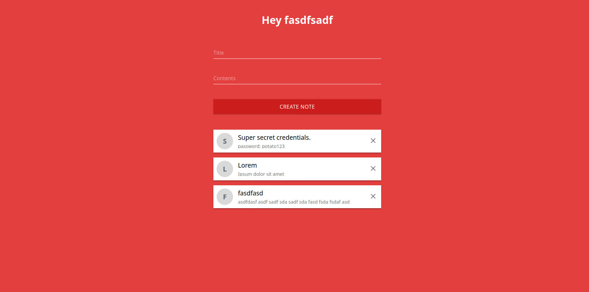

# NoteIt

NoteIt is a simple application for writing notes.

## How to run locally

- Install [MongoDB](https://www.mongodb.com/)
- Clone this repository by running `https://github.com/WinterCore/NoteIt.git`
- Change your current directory to the root folder of the repository `cd NoteIt`
- Run `npm install`
- Run `PORT=8000 MONGO_URI=<your local mongodb uri> SESSION_SECRET=<random string> npm start`

